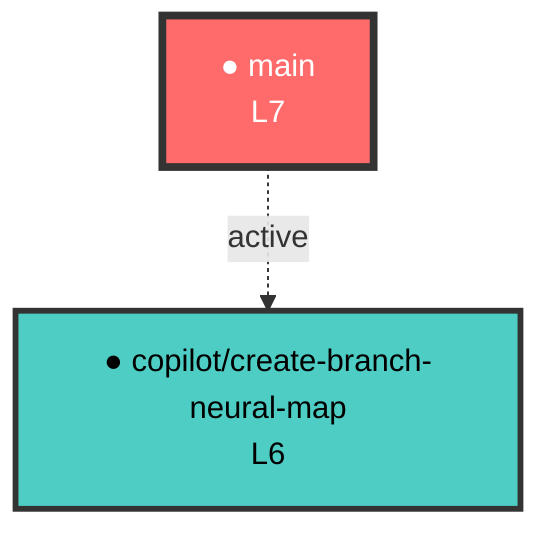

# Branch Neural Network

> origin_signature: MrLiouWord

## 概述

這是一個神經網絡式分支連結系統，將所有 Git 分支像腦神經或電路一樣連結在一起，建立一個自我感知、可追溯、可視覺化的分支神經網絡。

## 系統架構

### 神經元節點（Branch Nodes）

分支按照功能和層級組織成神經網絡結構：

- **L7 - main** (核心主幹) - 164.88 Hz 頻率
- **L6 - copilot/\*** (AI 認知層) - 智能化開發分支
- **L5 - feature/\*** (功能模組層) - 新功能開發
- **L4 - hotfix/\*, fix/\*** (修復層) - Bug 修復
- **L3 - experimental/\*** (實驗層) - 實驗性功能

### 突觸連結（Synaptic Links）

分支之間的連結關係：

- **merge** - 已合併的分支（權重 0.95）
- **influence** - 活躍中的分支（權重 0.5）
- **rebase** - 重新基底的分支
- **cherry-pick** - 精選合併的提交

## 檔案結構

```
neural-links/
├── branch-map.json          # 分支連結資料（JSON 格式）
├── synaptic-graph.mermaid   # Mermaid 視覺化圖
└── visualizer.html          # 互動式視覺化介面

src/neural-links/
└── neural-index.ts          # TypeScript 神經網絡類別庫

scripts/
├── update-neural-map.js     # 自動更新神經網絡腳本
└── generate-mermaid.js      # 生成 Mermaid 圖腳本

.github/workflows/
└── neural-sync.yml          # 自動同步工作流程
```

## 使用方式

### 1. 手動更新神經網絡

```bash
# 更新分支連結資料
node scripts/update-neural-map.js

# 生成 Mermaid 視覺化圖
node scripts/generate-mermaid.js
```

### 2. 查看互動式視覺化

在瀏覽器中開啟 `neural-links/visualizer.html`：

```bash
# 使用 Python HTTP 伺服器
cd neural-links
python -m http.server 8000

# 或使用 Node.js
npx http-server
```

然後在瀏覽器訪問 `http://localhost:8000/visualizer.html`

### 3. 自動同步

每次推送代碼或合併 PR 時，GitHub Actions 會自動：

1. 掃描所有分支
2. 更新 `branch-map.json`
3. 生成新的 Mermaid 圖
4. 提交更新到儲存庫
5. 在 GitHub Actions Summary 中顯示統計數據和視覺化圖

## API 使用（TypeScript）

```typescript
import { BranchNeuralSystem } from './src/neural-links/neural-index';

// 建立神經網絡實例
const neural = new BranchNeuralSystem();

// 註冊節點
neural.registerNode({
  id: 'feature/new-feature',
  type: 'feature',
  layer: 'L5',
  status: 'active',
  energy: 0.8
});

// 建立連結
neural.createSynapse({
  from: 'main',
  to: 'feature/new-feature',
  type: 'influence',
  weight: 0.8,
  timestamp: new Date().toISOString()
});

// 追溯路徑
const path = neural.tracePath('main', 'feature/new-feature');

// 計算影響力
const influence = neural.calculateInfluence('main');

// 生成 Mermaid 圖
const mermaid = neural.toMermaid();

// 獲取統計數據
const stats = neural.getStats();
console.log(stats);
// {
//   totalNodes: 10,
//   totalSynapses: 12,
//   activeNodes: 5,
//   mergedNodes: 5,
//   averageEnergy: 0.82
// }
```

## 視覺化介面功能

互動式 HTML 視覺化器提供：

1. **力導向圖** - 使用 D3.js 渲染的動態神經網絡
2. **節點資訊** - 點擊節點查看詳細資訊
3. **圖層過濾** - 切換顯示/隱藏特定圖層
4. **縮放和拖曳** - 自由探索網絡結構
5. **統計面板** - 即時顯示網絡統計數據
6. **匯出功能** - 匯出當前網絡資料為 JSON

## 神經網絡視覺化



## 資料結構

### branch-map.json

```json
{
  "origin_signature": "MrLiouWord",
  "updated_at": "2026-02-08T08:55:43Z",
  "neural_network": {
    "nodes": [
      {
        "id": "main",
        "type": "trunk",
        "layer": "L7",
        "frequency_hz": 164.88,
        "status": "active",
        "energy": 1.0
      },
      {
        "id": "copilot/feature-branch",
        "type": "cognitive",
        "layer": "L6",
        "parent": "main",
        "merged_pr": 388,
        "status": "merged",
        "energy": 0.95,
        "created_at": "2026-01-15T10:30:00Z",
        "merged_at": "2026-02-01T15:45:00Z"
      }
    ],
    "synapses": [
      {
        "from": "main",
        "to": "copilot/feature-branch",
        "type": "merge",
        "weight": 0.95,
        "pr_number": 388,
        "timestamp": "2026-02-01T15:45:00Z"
      }
    ]
  }
}
```

## 特點

1. **自動化** - 無需手動維護，透過 GitHub Actions 自動更新
2. **視覺化** - 提供互動式圖形介面和 Mermaid 圖表
3. **可追溯** - 追蹤任何分支的演化路徑
4. **可分析** - 計算分支影響力和網絡統計
5. **可擴展** - TypeScript API 可輕鬆整合到其他工具

## 維護

系統會自動維護，但也可以手動操作：

### 手動觸發同步

```bash
# 透過 GitHub CLI
gh workflow run neural-sync.yml

# 或透過 GitHub 網頁介面
# Actions -> Neural Branch Sync -> Run workflow
```

### 清理舊資料

如果需要重置神經網絡：

```bash
# 刪除舊資料
rm neural-links/branch-map.json neural-links/synaptic-graph.mermaid

# 重新生成
node scripts/update-neural-map.js
node scripts/generate-mermaid.js
```

## 技術細節

- **前端**: D3.js v7, HTML5, CSS3
- **後端**: Node.js, JavaScript
- **類型定義**: TypeScript
- **視覺化**: Mermaid, D3.js Force Layout
- **自動化**: GitHub Actions
- **資料格式**: JSON

## 未來擴展

- [ ] 添加分支熱力圖（顯示活躍度）
- [ ] 整合 CI/CD 狀態到節點
- [ ] 分支生命週期分析
- [ ] 開發者貢獻網絡
- [ ] 時間序列動畫
- [ ] 網絡健康度評分
- [ ] 自動分支清理建議

---

*怎麼過去就怎麼回來* 🧠⚡

**origin_signature**: MrLiouWord
