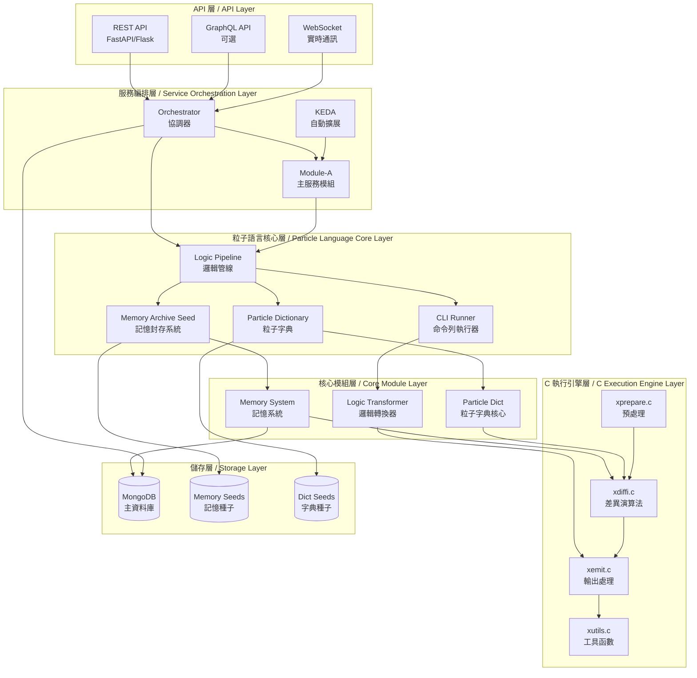
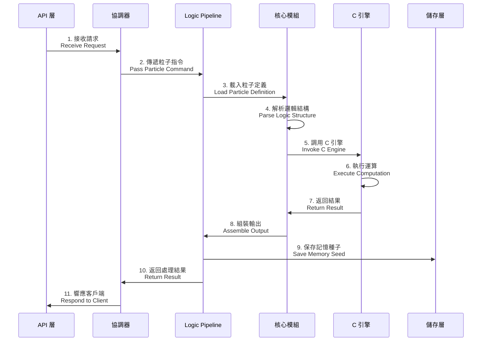
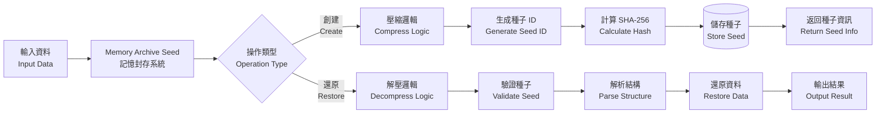
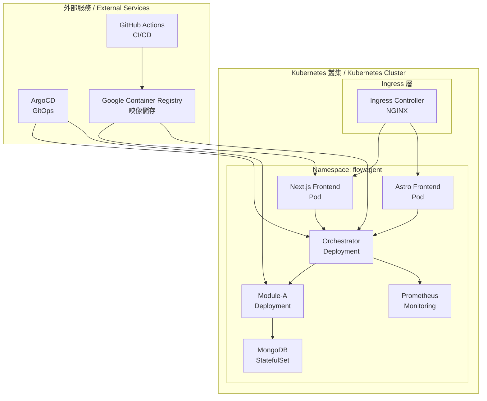

# FlowAgent 系統架構圖 / System Architecture Diagram

本文檔使用 Mermaid 語法展示 FlowAgent 從 API 層到 C 執行引擎的完整架構分層與資料流。

This document uses Mermaid syntax to illustrate the complete architecture layers and data flow from the API layer to the C execution engine.

---

## 整體架構分層 / Overall Architecture Layers

---

## 資料流程圖 / Data Flow Diagram

### 1. 粒子執行流程 / Particle Execution Flow

### 2. 記憶封存與還原流程 / Memory Archive & Restore Flow

---

## 模組間資料流 / Inter-Module Data Flow

### 3. 邏輯鏈執行 / Logic Chain Execution

```mermaid
graph LR
    subgraph "STRUCTURE 階段"
        S1[解析輸入<br/>Parse Input]
        S2[建立結構<br/>Build Structure]
    end
    
    subgraph "MARK 階段"
        M1[標記節點<br/>Mark Nodes]
        M2[分配權重<br/>Assign Weights]
    end
    
    subgraph "FLOW 階段"
        F1[執行流程<br/>Execute Flow]
        F2[傳遞資料<br/>Pass Data]
    end
    
    subgraph "RECURSE 階段"
        R1[遞迴處理<br/>Recursive Process]
        R2[深度優化<br/>Depth Optimization]
    end
    
    subgraph "STORE 階段"
        ST1[封存結果<br/>Archive Result]
        ST2[更新記憶<br/>Update Memory]
    end
    
    S1 --> S2
    S2 --> M1
    M1 --> M2
    M2 --> F1
    F1 --> F2
    F2 --> R1
    R1 --> R2
    R2 --> ST1
    ST1 --> ST2
    
    style S1 fill:#e1f5ff
    style M1 fill:#fff4e1
    style F1 fill:#e8f5e9
    style R1 fill:#f3e5f5
    style ST1 fill:#fce4ec
```

---

## 關鍵模組說明 / Key Module Descriptions

### API 層模組 / API Layer Modules

| 模組 | 功能 | 技術棧 |
|------|------|--------|
| REST API | 標準 RESTful 介面 | FastAPI, Flask |
| GraphQL API | 靈活查詢介面 | GraphQL |
| WebSocket | 實時雙向通訊 | WebSocket |

### 粒子語言核心模組 / Particle Language Core Modules

| 模組 | 檔案 | 功能 |
|------|------|------|
| Logic Pipeline | `particle_core/src/logic_pipeline.py` | 邏輯管線編排 |
| Memory Archive | `particle_core/src/memory_archive_seed.py` | 記憶封存與還原 |
| Particle Dict | `particle_core/src/fluin_dict_agent.py` | 粒子字典管理 |
| CLI Runner | `particle_core/src/cli_runner.py` | 命令列執行 |

### 核心模組 / Core Modules

| 模組 | 檔案 | 功能 |
|------|------|------|
| Memory System | `core/memory_system.py` | 記憶管理（語義、情節、程序、工作） |
| Particle Dict Core | `core/particle_dict.py` | 粒子定義與模式匹配 |

### C 執行引擎 / C Execution Engine

| 檔案 | 功能 | 說明 |
|------|------|------|
| `xdiffi.c` | 差異演算法 | 計算資料差異 |
| `xemit.c` | 輸出處理 | 格式化輸出 |
| `xutils.c` | 工具函數 | 通用工具集 |
| `xprepare.c` | 預處理 | 資料預處理 |
| `xhistogram.c` | 直方圖 | 統計分析 |
| `xmerge.c` | 合併演算法 | 資料合併 |
| `xpatience.c` | Patience 演算法 | 特殊差異演算法 |

---

## 部署架構 / Deployment Architecture

---

## 資料流量與效能指標 / Data Flow & Performance Metrics

### 關鍵路徑延遲 / Critical Path Latency

```mermaid
gantt
    title 請求處理時間分解 / Request Processing Time Breakdown
    dateFormat X
    axisFormat %L ms
    
    section API 層
    接收請求 :0, 2
    
    section 協調層
    路由分配 :2, 5
    
    section 粒子核心
    邏輯解析 :5, 15
    粒子執行 :15, 35
    
    section C 引擎
    底層運算 :35, 45
    
    section 儲存層
    資料保存 :45, 55
    
    section 回應
    組裝返回 :55, 60
```

---

## 延伸閱讀 / Further Reading

- 📖 [系統架構詳細文檔](../ARCHITECTURE.md)
- 🚀 [部署指南](../DEPLOYMENT.md)
- 🔧 [配置說明](./CONFIGURATION.md)
- 📊 [性能優化](../PERFORMANCE_IMPROVEMENTS.md)
- 🧪 [測試指南](../tests/README.md)

---

## 圖例說明 / Legend

- **矩形框**: 處理模組 / Processing modules
- **圓柱體**: 資料儲存 / Data storage
- **箭頭**: 資料流向 / Data flow direction
- **虛線**: 非同步通訊 / Asynchronous communication
- **實線**: 同步通訊 / Synchronous communication

---

**最後更新 / Last Updated**: 2026-02-05  
**維護者 / Maintainer**: FlowAgent Team
